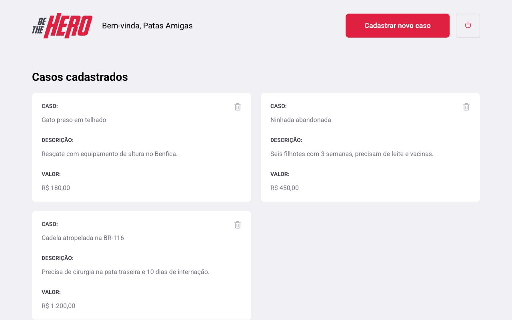

<p align="center">
  
</p>

<p align="center">
  NGOs register the cases they need help with; people find one and get in touch.<br>
  <sub>Node 24 · Express 5 · Knex · SQLite · React 19 · Vite</sub>
</p>

<br>

An NGO signs up, gets an eight-character id, and lists cases: an injured dog
that needs surgery, a litter that needs vaccines, with the amount it would
take. Anyone with the mobile app browses the cases and reaches the NGO on
WhatsApp or by email.

I built this in March 2020 during Rocketseat's OmniStack week, my first
full-stack app with a real API, a web front and a mobile client. In 2026 I
brought the API and the web app up to current versions so they run again,
and kept the mobile client as it was.



## Running it

Two terminals. The API keeps its data in a SQLite file that the migrations
create.

```bash
cd backend
npm install
npm run migrate
npm run dev          # http://localhost:3333
```

```bash
cd frontend
npm install
npm run dev          # http://localhost:3000
```

Register an NGO on the web app, note the id it shows, and log on with it.
The API's port comes from `PORT`; the web app reads `VITE_API_URL` (see
`frontend/.env.example`) and defaults to localhost.

| Where | Command | |
| --- | --- | --- |
| `backend` | `npm test` | 8 integration tests over the real routes and a test database |
| `frontend` | `npm test` | 4 tests with a mocked API: logon, profile, delete, redirect |
| `frontend` | `npm run build` | production build to `dist/` |

## What changed in 2026

**Backend.** The `sqlite3` driver, which needed a native build that no
longer succeeded, gave way to `better-sqlite3`. Express 4 to 5, Knex 0.20 to
3, celebrate 12 to 15, Jest 25 to 30, socket.io 2 to 4. The database files
left the repository. Creating and listing incidents now check that the NGO
exists, deleting an incident that is not there is a 404 rather than a crash,
and the public list comes newest first.

**Frontend.** Create React App to Vite, React 16 to 19, React Router 5 to 7,
Axios 0.19 to 1. The socket connection is opened once per tab and its
listener removed on unmount; the original registered a new one on every
render. Errors show on the page instead of in `alert()`, the registration
screen shows the new id instead of an alert, and a visitor without a session
is sent to the logon.

**Mobile.** `mobile/` is the original Expo 36 code, kept for reference. It
does not run on a current Expo Go without an upgrade I have not done.

## How it is put together

```
backend/src/
  routes.js            the six routes, each with a celebrate schema
  controllers/         ongs, sessions, profile, incidents
  database/            knex connection and two migrations
frontend/src/
  pages/               Logon, Register, Profile, NewIncident
  services/            axios instance and the socket
mobile/                Expo 36, unchanged
```

Authentication is the NGO id in an `Authorization` header, which is what the
original course did and enough for a demo. Anything real would use a token.

## What's missing

- No real authentication; see above.
- The mobile client is not upgraded.
- The public incidents list has an API but no web page; the mobile app was
  its only consumer.
